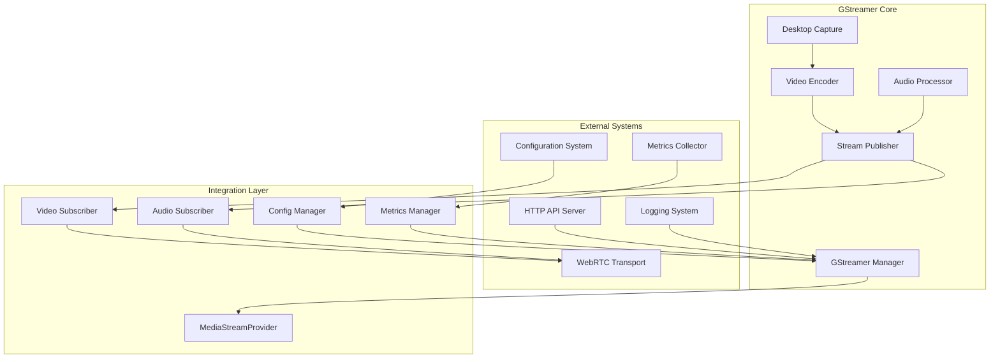
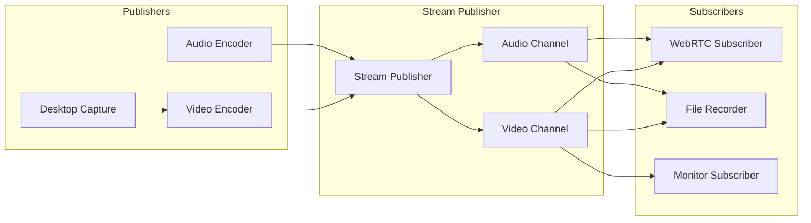

# GStreamer 组件集成指南

## 概述

本文档详细说明了重构后的 GStreamer 组件与 WebRTC、配置系统、监控系统等其他组件的集成方式。新架构采用发布-订阅模式，提供了清晰的接口边界和高度的可扩展性。

## 架构概览

### 集成架构图



## WebRTC 集成

### 1. 基本集成模式

WebRTC 组件通过订阅者模式接收 GStreamer 的媒体流数据。

#### 1.1 创建 WebRTC 视频订阅者

```go
// WebRTCVideoSubscriber WebRTC 视频流订阅者
type WebRTCVideoSubscriber struct {
    // WebRTC 相关
    track          *webrtc.TrackLocalStaticSample
    peerConnection *webrtc.PeerConnection
    
    // 统计和监控
    stats          *VideoSubscriberStats
    
    // 网络自适应
    networkMonitor *NetworkMonitor
    qualityController *QualityController
    
    // 配置和日志
    config         *WebRTCVideoConfig
    logger         *logrus.Entry
    
    // 同步控制
    mutex          sync.RWMutex
    isActive       bool
}

// NewWebRTCVideoSubscriber 创建 WebRTC 视频订阅者
func NewWebRTCVideoSubscriber(pc *webrtc.PeerConnection, config *WebRTCVideoConfig) (*WebRTCVideoSubscriber, error) {
    // 创建视频轨道
    track, err := webrtc.NewTrackLocalStaticSample(
        webrtc.RTPCodecCapability{
            MimeType:  webrtc.MimeTypeH264,
            ClockRate: 90000,
        },
        "video",
        "gstreamer-video",
    )
    if err != nil {
        return nil, fmt.Errorf("failed to create video track: %w", err)
    }
    
    // 添加轨道到 PeerConnection
    rtpSender, err := pc.AddTrack(track)
    if err != nil {
        return nil, fmt.Errorf("failed to add track: %w", err)
    }
    
    subscriber := &WebRTCVideoSubscriber{
        track:          track,
        peerConnection: pc,
        stats:          NewVideoSubscriberStats(),
        networkMonitor: NewNetworkMonitor(rtpSender),
        qualityController: NewQualityController(),
        config:         config,
        logger:         logrus.WithField("component", "webrtc-video-subscriber"),
        isActive:       true,
    }
    
    // 启动网络监控
    go subscriber.startNetworkMonitoring()
    
    return subscriber, nil
}

// OnVideoFrame 实现 VideoStreamSubscriber 接口
func (w *WebRTCVideoSubscriber) OnVideoFrame(frame *gstreamer.EncodedVideoFrame) error {
    w.mutex.RLock()
    defer w.mutex.RUnlock()
    
    if !w.isActive {
        return nil // 订阅者已停用
    }
    
    // 更新统计信息
    w.stats.RecordFrame(frame)
    
    // 创建 RTP 样本
    sample := media.Sample{
        Data:     frame.Data,
        Duration: frame.Duration,
    }
    
    // 发送到 WebRTC
    if err := w.track.WriteSample(sample); err != nil {
        w.stats.RecordError(err)
        return fmt.Errorf("failed to write video sample: %w", err)
    }
    
    w.logger.Debugf("Sent video frame: %d bytes, %dx%d, keyframe=%v, seq=%d",
        len(frame.Data), frame.Width, frame.Height, frame.KeyFrame, frame.SequenceNumber)
    
    return nil
}

// OnVideoError 处理视频错误
func (w *WebRTCVideoSubscriber) OnVideoError(err error) error {
    w.logger.Errorf("Video stream error: %v", err)
    w.stats.RecordError(err)
    
    // 根据错误类型决定处理策略
    switch {
    case isNetworkError(err):
        return w.handleNetworkError(err)
    case isEncodingError(err):
        return w.handleEncodingError(err)
    default:
        return w.handleGenericError(err)
    }
}

// GetSubscriberInfo 获取订阅者信息
func (w *WebRTCVideoSubscriber) GetSubscriberInfo() gstreamer.SubscriberInfo {
    return gstreamer.SubscriberInfo{
        ID:          fmt.Sprintf("webrtc-video-%p", w),
        Type:        "webrtc-video",
        Description: "WebRTC Video Transport",
        Capabilities: map[string]interface{}{
            "codecs":     []string{"h264", "vp8", "vp9"},
            "max_width":  1920,
            "max_height": 1080,
            "max_fps":    60,
        },
    }
}

// OnNetworkFeedback 处理网络反馈
func (w *WebRTCVideoSubscriber) OnNetworkFeedback(feedback gstreamer.NetworkFeedback) error {
    w.logger.Debugf("Received network feedback: %+v", feedback)
    
    // 更新网络监控器
    w.networkMonitor.UpdateFeedback(feedback)
    
    // 计算质量调整
    adjustment := w.qualityController.CalculateAdjustment(feedback)
    
    // 如果需要调整质量，通知 GStreamer
    if adjustment.ShouldAdjust {
        return w.requestQualityAdjustment(adjustment)
    }
    
    return nil
}

// OnQualityChanged 质量变化通知
func (w *WebRTCVideoSubscriber) OnQualityChanged(quality gstreamer.VideoQuality) error {
    w.logger.Infof("Video quality changed: %dx%d@%dfps, bitrate=%d",
        quality.Width, quality.Height, quality.Framerate, quality.Bitrate)
    
    // 更新本地配置
    w.config.CurrentQuality = quality
    
    // 通知 WebRTC 层质量变化
    return w.notifyQualityChange(quality)
}
```

#### 1.2 创建 WebRTC 音频订阅者

```go
// WebRTCAudioSubscriber WebRTC 音频流订阅者
type WebRTCAudioSubscriber struct {
    track          *webrtc.TrackLocalStaticSample
    peerConnection *webrtc.PeerConnection
    stats          *AudioSubscriberStats
    config         *WebRTCAudioConfig
    logger         *logrus.Entry
    mutex          sync.RWMutex
    isActive       bool
}

// NewWebRTCAudioSubscriber 创建 WebRTC 音频订阅者
func NewWebRTCAudioSubscriber(pc *webrtc.PeerConnection, config *WebRTCAudioConfig) (*WebRTCAudioSubscriber, error) {
    // 创建音频轨道
    track, err := webrtc.NewTrackLocalStaticSample(
        webrtc.RTPCodecCapability{
            MimeType:  webrtc.MimeTypeOpus,
            ClockRate: 48000,
            Channels:  2,
        },
        "audio",
        "gstreamer-audio",
    )
    if err != nil {
        return nil, fmt.Errorf("failed to create audio track: %w", err)
    }
    
    // 添加轨道到 PeerConnection
    if _, err := pc.AddTrack(track); err != nil {
        return nil, fmt.Errorf("failed to add audio track: %w", err)
    }
    
    return &WebRTCAudioSubscriber{
        track:          track,
        peerConnection: pc,
        stats:          NewAudioSubscriberStats(),
        config:         config,
        logger:         logrus.WithField("component", "webrtc-audio-subscriber"),
        isActive:       true,
    }, nil
}

// OnAudioFrame 实现 AudioStreamSubscriber 接口
func (w *WebRTCAudioSubscriber) OnAudioFrame(frame *gstreamer.EncodedAudioFrame) error {
    w.mutex.RLock()
    defer w.mutex.RUnlock()
    
    if !w.isActive {
        return nil
    }
    
    // 更新统计信息
    w.stats.RecordFrame(frame)
    
    // 创建 RTP 样本
    sample := media.Sample{
        Data:     frame.Data,
        Duration: frame.Duration,
    }
    
    // 发送到 WebRTC
    if err := w.track.WriteSample(sample); err != nil {
        w.stats.RecordError(err)
        return fmt.Errorf("failed to write audio sample: %w", err)
    }
    
    w.logger.Debugf("Sent audio frame: %d bytes, %dHz, %dch, seq=%d",
        len(frame.Data), frame.SampleRate, frame.Channels, frame.SequenceNumber)
    
    return nil
}
```

#### 1.3 WebRTC 集成管理器

```go
// WebRTCIntegrationManager WebRTC 集成管理器
type WebRTCIntegrationManager struct {
    gstreamerManager gstreamer.Manager
    peerConnections  map[string]*webrtc.PeerConnection
    videoSubscribers map[string]*WebRTCVideoSubscriber
    audioSubscribers map[string]*WebRTCAudioSubscriber
    
    config           *WebRTCIntegrationConfig
    logger           *logrus.Entry
    mutex            sync.RWMutex
}

// NewWebRTCIntegrationManager 创建 WebRTC 集成管理器
func NewWebRTCIntegrationManager(gm gstreamer.Manager, config *WebRTCIntegrationConfig) *WebRTCIntegrationManager {
    return &WebRTCIntegrationManager{
        gstreamerManager: gm,
        peerConnections:  make(map[string]*webrtc.PeerConnection),
        videoSubscribers: make(map[string]*WebRTCVideoSubscriber),
        audioSubscribers: make(map[string]*WebRTCAudioSubscriber),
        config:           config,
        logger:           logrus.WithField("component", "webrtc-integration"),
    }
}

// AddPeerConnection 添加新的 WebRTC 连接
func (w *WebRTCIntegrationManager) AddPeerConnection(sessionID string, pc *webrtc.PeerConnection) error {
    w.mutex.Lock()
    defer w.mutex.Unlock()
    
    // 检查是否已存在
    if _, exists := w.peerConnections[sessionID]; exists {
        return fmt.Errorf("peer connection %s already exists", sessionID)
    }
    
    // 创建视频订阅者
    videoSubscriber, err := NewWebRTCVideoSubscriber(pc, w.config.Video)
    if err != nil {
        return fmt.Errorf("failed to create video subscriber: %w", err)
    }
    
    // 创建音频订阅者
    audioSubscriber, err := NewWebRTCAudioSubscriber(pc, w.config.Audio)
    if err != nil {
        return fmt.Errorf("failed to create audio subscriber: %w", err)
    }
    
    // 添加到 GStreamer 管理器
    if err := w.gstreamerManager.AddVideoSubscriber(videoSubscriber); err != nil {
        return fmt.Errorf("failed to add video subscriber to GStreamer: %w", err)
    }
    
    if err := w.gstreamerManager.AddAudioSubscriber(audioSubscriber); err != nil {
        // 清理已添加的视频订阅者
        w.gstreamerManager.RemoveVideoSubscriber(videoSubscriber)
        return fmt.Errorf("failed to add audio subscriber to GStreamer: %w", err)
    }
    
    // 保存引用
    w.peerConnections[sessionID] = pc
    w.videoSubscribers[sessionID] = videoSubscriber
    w.audioSubscribers[sessionID] = audioSubscriber
    
    w.logger.Infof("Added WebRTC peer connection: %s", sessionID)
    
    return nil
}

// RemovePeerConnection 移除 WebRTC 连接
func (w *WebRTCIntegrationManager) RemovePeerConnection(sessionID string) error {
    w.mutex.Lock()
    defer w.mutex.Unlock()
    
    // 获取订阅者
    videoSubscriber, hasVideo := w.videoSubscribers[sessionID]
    audioSubscriber, hasAudio := w.audioSubscribers[sessionID]
    
    // 从 GStreamer 管理器移除订阅者
    if hasVideo {
        if err := w.gstreamerManager.RemoveVideoSubscriber(videoSubscriber); err != nil {
            w.logger.Errorf("Failed to remove video subscriber: %v", err)
        }
        videoSubscriber.Close()
        delete(w.videoSubscribers, sessionID)
    }
    
    if hasAudio {
        if err := w.gstreamerManager.RemoveAudioSubscriber(audioSubscriber); err != nil {
            w.logger.Errorf("Failed to remove audio subscriber: %v", err)
        }
        audioSubscriber.Close()
        delete(w.audioSubscribers, sessionID)
    }
    
    // 关闭 PeerConnection
    if pc, exists := w.peerConnections[sessionID]; exists {
        if err := pc.Close(); err != nil {
            w.logger.Errorf("Failed to close peer connection: %v", err)
        }
        delete(w.peerConnections, sessionID)
    }
    
    w.logger.Infof("Removed WebRTC peer connection: %s", sessionID)
    
    return nil
}
```

### 2. 网络自适应集成

#### 2.1 网络监控器

```go
// NetworkMonitor 网络监控器
type NetworkMonitor struct {
    rtpSender      *webrtc.RTPSender
    stats          *NetworkStats
    feedbackChan   chan gstreamer.NetworkFeedback
    stopChan       chan struct{}
    logger         *logrus.Entry
}

// NewNetworkMonitor 创建网络监控器
func NewNetworkMonitor(rtpSender *webrtc.RTPSender) *NetworkMonitor {
    return &NetworkMonitor{
        rtpSender:    rtpSender,
        stats:        NewNetworkStats(),
        feedbackChan: make(chan gstreamer.NetworkFeedback, 100),
        stopChan:     make(chan struct{}),
        logger:       logrus.WithField("component", "network-monitor"),
    }
}

// Start 启动网络监控
func (n *NetworkMonitor) Start() {
    go n.monitorLoop()
}

// monitorLoop 监控循环
func (n *NetworkMonitor) monitorLoop() {
    ticker := time.NewTicker(1 * time.Second)
    defer ticker.Stop()
    
    for {
        select {
        case <-ticker.C:
            if err := n.collectStats(); err != nil {
                n.logger.Errorf("Failed to collect network stats: %v", err)
            }
            
        case <-n.stopChan:
            return
        }
    }
}

// collectStats 收集网络统计
func (n *NetworkMonitor) collectStats() error {
    // 获取 RTP 统计信息
    stats := n.rtpSender.GetStats()
    
    // 计算网络条件
    condition := n.calculateNetworkCondition(stats)
    
    // 生成反馈
    feedback := gstreamer.NetworkFeedback{
        SubscriberID:     n.getSubscriberID(),
        PacketsReceived:  stats.PacketsSent - stats.PacketsLost,
        PacketsLost:      stats.PacketsLost,
        BytesReceived:    stats.BytesSent,
        Jitter:           time.Duration(stats.Jitter) * time.Nanosecond,
        RTT:              time.Duration(stats.RoundTripTime) * time.Millisecond,
        Timestamp:        time.Now(),
        RequestedBitrate: n.calculateRequestedBitrate(condition),
        RequestedQuality: n.calculateRequestedQuality(condition),
    }
    
    // 发送反馈
    select {
    case n.feedbackChan <- feedback:
    default:
        n.logger.Warn("Feedback channel full, dropping feedback")
    }
    
    return nil
}
```

#### 2.2 质量控制器

```go
// QualityController 质量控制器
type QualityController struct {
    currentQuality   gstreamer.VideoQuality
    targetQuality    gstreamer.VideoQuality
    adaptationHistory []QualityAdaptation
    
    config           *QualityControlConfig
    logger           *logrus.Entry
    mutex            sync.RWMutex
}

// QualityAdaptation 质量适应记录
type QualityAdaptation struct {
    Timestamp        time.Time
    FromQuality      gstreamer.VideoQuality
    ToQuality        gstreamer.VideoQuality
    Reason           string
    NetworkCondition gstreamer.NetworkCondition
}

// CalculateAdjustment 计算质量调整
func (q *QualityController) CalculateAdjustment(feedback gstreamer.NetworkFeedback) QualityAdjustment {
    q.mutex.Lock()
    defer q.mutex.Unlock()
    
    // 计算网络质量
    networkQuality := q.assessNetworkQuality(feedback)
    
    // 确定目标质量
    targetQuality := q.determineTargetQuality(networkQuality)
    
    // 检查是否需要调整
    shouldAdjust := q.shouldAdjustQuality(targetQuality)
    
    adjustment := QualityAdjustment{
        ShouldAdjust:   shouldAdjust,
        TargetQuality:  targetQuality,
        Reason:         q.getAdjustmentReason(networkQuality),
        Confidence:     q.calculateConfidence(feedback),
    }
    
    if shouldAdjust {
        q.recordAdaptation(q.currentQuality, targetQuality, adjustment.Reason, feedback)
        q.targetQuality = targetQuality
    }
    
    return adjustment
}

// assessNetworkQuality 评估网络质量
func (q *QualityController) assessNetworkQuality(feedback gstreamer.NetworkFeedback) NetworkQuality {
    // 计算丢包率
    packetLossRate := float64(feedback.PacketsLost) / float64(feedback.PacketsReceived+feedback.PacketsLost)
    
    // 评估 RTT
    rttMs := feedback.RTT.Milliseconds()
    
    // 评估抖动
    jitterMs := feedback.Jitter.Milliseconds()
    
    // 综合评估
    score := 100.0
    
    // 丢包率影响 (0-1% 优秀, 1-3% 良好, 3-5% 一般, >5% 差)
    if packetLossRate > 0.05 {
        score -= 40
    } else if packetLossRate > 0.03 {
        score -= 25
    } else if packetLossRate > 0.01 {
        score -= 10
    }
    
    // RTT 影响 (<50ms 优秀, 50-100ms 良好, 100-200ms 一般, >200ms 差)
    if rttMs > 200 {
        score -= 30
    } else if rttMs > 100 {
        score -= 20
    } else if rttMs > 50 {
        score -= 10
    }
    
    // 抖动影响
    if jitterMs > 50 {
        score -= 20
    } else if jitterMs > 20 {
        score -= 10
    }
    
    // 确定质量等级
    if score >= 80 {
        return NetworkQualityExcellent
    } else if score >= 60 {
        return NetworkQualityGood
    } else if score >= 40 {
        return NetworkQualityFair
    } else {
        return NetworkQualityPoor
    }
}
```

## 配置系统集成

### 1. 配置管理器

```go
// ConfigurationManager 配置管理器
type ConfigurationManager struct {
    gstreamerManager gstreamer.Manager
    configWatcher    *ConfigWatcher
    validators       []ConfigValidator
    
    currentConfig    *config.GStreamerConfig
    configHistory    []ConfigChange
    
    logger           *logrus.Entry
    mutex            sync.RWMutex
}

// ConfigChange 配置变更记录
type ConfigChange struct {
    Timestamp    time.Time
    FromConfig   *config.GStreamerConfig
    ToConfig     *config.GStreamerConfig
    ChangedFields []string
    Reason       string
    Success      bool
    Error        error
}

// NewConfigurationManager 创建配置管理器
func NewConfigurationManager(gm gstreamer.Manager) *ConfigurationManager {
    cm := &ConfigurationManager{
        gstreamerManager: gm,
        validators:       make([]ConfigValidator, 0),
        configHistory:    make([]ConfigChange, 0),
        logger:           logrus.WithField("component", "config-manager"),
    }
    
    // 添加默认验证器
    cm.AddValidator(&BasicConfigValidator{})
    cm.AddValidator(&HardwareCapabilityValidator{})
    cm.AddValidator(&NetworkConfigValidator{})
    
    return cm
}

// UpdateConfiguration 更新配置
func (c *ConfigurationManager) UpdateConfiguration(newConfig *config.GStreamerConfig, reason string) error {
    c.mutex.Lock()
    defer c.mutex.Unlock()
    
    oldConfig := c.currentConfig
    
    // 验证新配置
    if err := c.validateConfiguration(newConfig); err != nil {
        c.recordConfigChange(oldConfig, newConfig, nil, reason, false, err)
        return fmt.Errorf("configuration validation failed: %w", err)
    }
    
    // 检测变更字段
    changedFields := c.detectChangedFields(oldConfig, newConfig)
    
    // 应用配置
    if err := c.gstreamerManager.UpdateConfig(newConfig); err != nil {
        c.recordConfigChange(oldConfig, newConfig, changedFields, reason, false, err)
        return fmt.Errorf("failed to apply configuration: %w", err)
    }
    
    // 更新当前配置
    c.currentConfig = newConfig
    c.recordConfigChange(oldConfig, newConfig, changedFields, reason, true, nil)
    
    c.logger.Infof("Configuration updated successfully: %v", changedFields)
    
    return nil
}

// validateConfiguration 验证配置
func (c *ConfigurationManager) validateConfiguration(config *config.GStreamerConfig) error {
    for _, validator := range c.validators {
        if err := validator.Validate(config); err != nil {
            return fmt.Errorf("validation failed by %s: %w", validator.Name(), err)
        }
    }
    return nil
}

// ConfigValidator 配置验证器接口
type ConfigValidator interface {
    Name() string
    Validate(config *config.GStreamerConfig) error
}

// BasicConfigValidator 基本配置验证器
type BasicConfigValidator struct{}

func (b *BasicConfigValidator) Name() string {
    return "BasicConfigValidator"
}

func (b *BasicConfigValidator) Validate(config *config.GStreamerConfig) error {
    // 验证桌面捕获配置
    if config.DesktopCapture.Framerate <= 0 || config.DesktopCapture.Framerate > 120 {
        return fmt.Errorf("invalid framerate: %d", config.DesktopCapture.Framerate)
    }
    
    if config.DesktopCapture.Width <= 0 || config.DesktopCapture.Height <= 0 {
        return fmt.Errorf("invalid resolution: %dx%d", config.DesktopCapture.Width, config.DesktopCapture.Height)
    }
    
    // 验证视频编码配置
    if config.VideoEncoder.Bitrate <= 0 {
        return fmt.Errorf("invalid bitrate: %d", config.VideoEncoder.Bitrate)
    }
    
    validCodecs := []string{"h264", "vp8", "vp9"}
    if !contains(validCodecs, config.VideoEncoder.Codec) {
        return fmt.Errorf("unsupported codec: %s", config.VideoEncoder.Codec)
    }
    
    return nil
}
```

### 2. 配置监听器

```go
// ConfigWatcher 配置文件监听器
type ConfigWatcher struct {
    configPath       string
    configManager    *ConfigurationManager
    watcher          *fsnotify.Watcher
    reloadChan       chan struct{}
    stopChan         chan struct{}
    logger           *logrus.Entry
}

// NewConfigWatcher 创建配置监听器
func NewConfigWatcher(configPath string, cm *ConfigurationManager) (*ConfigWatcher, error) {
    watcher, err := fsnotify.NewWatcher()
    if err != nil {
        return nil, fmt.Errorf("failed to create file watcher: %w", err)
    }
    
    cw := &ConfigWatcher{
        configPath:    configPath,
        configManager: cm,
        watcher:       watcher,
        reloadChan:    make(chan struct{}, 1),
        stopChan:      make(chan struct{}),
        logger:        logrus.WithField("component", "config-watcher"),
    }
    
    // 添加配置文件到监听列表
    if err := watcher.Add(configPath); err != nil {
        return nil, fmt.Errorf("failed to watch config file: %w", err)
    }
    
    return cw, nil
}

// Start 启动配置监听
func (c *ConfigWatcher) Start() {
    go c.watchLoop()
}

// watchLoop 监听循环
func (c *ConfigWatcher) watchLoop() {
    for {
        select {
        case event, ok := <-c.watcher.Events:
            if !ok {
                return
            }
            
            if event.Op&fsnotify.Write == fsnotify.Write {
                c.logger.Infof("Config file modified: %s", event.Name)
                
                // 触发重新加载
                select {
                case c.reloadChan <- struct{}{}:
                default:
                    // 已有重新加载请求在队列中
                }
            }
            
        case err, ok := <-c.watcher.Errors:
            if !ok {
                return
            }
            c.logger.Errorf("Config watcher error: %v", err)
            
        case <-c.reloadChan:
            if err := c.reloadConfiguration(); err != nil {
                c.logger.Errorf("Failed to reload configuration: %v", err)
            }
            
        case <-c.stopChan:
            return
        }
    }
}

// reloadConfiguration 重新加载配置
func (c *ConfigWatcher) reloadConfiguration() error {
    // 读取配置文件
    newConfig, err := config.LoadFromFile(c.configPath)
    if err != nil {
        return fmt.Errorf("failed to load config file: %w", err)
    }
    
    // 更新配置
    return c.configManager.UpdateConfiguration(newConfig, "file-change")
}
```

## 监控系统集成

### 1. 指标收集器

```go
// MetricsCollector 指标收集器
type MetricsCollector struct {
    gstreamerManager gstreamer.Manager
    registry         *prometheus.Registry
    
    // GStreamer 指标
    frameRateGauge       prometheus.Gauge
    bitrateGauge         prometheus.Gauge
    droppedFramesCounter prometheus.Counter
    errorCounter         *prometheus.CounterVec
    latencyHistogram     prometheus.Histogram
    
    // 系统指标
    memoryUsageGauge     prometheus.Gauge
    cpuUsageGauge        prometheus.Gauge
    
    // 网络指标
    networkBandwidthGauge prometheus.Gauge
    packetLossGauge       prometheus.Gauge
    rttGauge              prometheus.Gauge
    
    logger               *logrus.Entry
    collectInterval      time.Duration
    stopChan             chan struct{}
}

// NewMetricsCollector 创建指标收集器
func NewMetricsCollector(gm gstreamer.Manager, registry *prometheus.Registry) *MetricsCollector {
    mc := &MetricsCollector{
        gstreamerManager: gm,
        registry:         registry,
        logger:           logrus.WithField("component", "metrics-collector"),
        collectInterval:  5 * time.Second,
        stopChan:         make(chan struct{}),
    }
    
    // 初始化指标
    mc.initializeMetrics()
    
    return mc
}

// initializeMetrics 初始化 Prometheus 指标
func (m *MetricsCollector) initializeMetrics() {
    // 帧率指标
    m.frameRateGauge = prometheus.NewGauge(prometheus.GaugeOpts{
        Name: "gstreamer_video_frame_rate",
        Help: "Current video frame rate",
    })
    
    // 比特率指标
    m.bitrateGauge = prometheus.NewGauge(prometheus.GaugeOpts{
        Name: "gstreamer_video_bitrate_bps",
        Help: "Current video bitrate in bits per second",
    })
    
    // 丢帧计数器
    m.droppedFramesCounter = prometheus.NewCounter(prometheus.CounterOpts{
        Name: "gstreamer_dropped_frames_total",
        Help: "Total number of dropped frames",
    })
    
    // 错误计数器
    m.errorCounter = prometheus.NewCounterVec(
        prometheus.CounterOpts{
            Name: "gstreamer_errors_total",
            Help: "Total number of errors by type",
        },
        []string{"error_type", "component"},
    )
    
    // 延迟直方图
    m.latencyHistogram = prometheus.NewHistogram(prometheus.HistogramOpts{
        Name:    "gstreamer_processing_latency_seconds",
        Help:    "Processing latency in seconds",
        Buckets: prometheus.DefBuckets,
    })
    
    // 内存使用指标
    m.memoryUsageGauge = prometheus.NewGauge(prometheus.GaugeOpts{
        Name: "gstreamer_memory_usage_bytes",
        Help: "Current memory usage in bytes",
    })
    
    // 注册所有指标
    m.registry.MustRegister(
        m.frameRateGauge,
        m.bitrateGauge,
        m.droppedFramesCounter,
        m.errorCounter,
        m.latencyHistogram,
        m.memoryUsageGauge,
    )
}

// Start 启动指标收集
func (m *MetricsCollector) Start() {
    go m.collectLoop()
}

// collectLoop 收集循环
func (m *MetricsCollector) collectLoop() {
    ticker := time.NewTicker(m.collectInterval)
    defer ticker.Stop()
    
    for {
        select {
        case <-ticker.C:
            if err := m.collectMetrics(); err != nil {
                m.logger.Errorf("Failed to collect metrics: %v", err)
            }
            
        case <-m.stopChan:
            return
        }
    }
}

// collectMetrics 收集指标
func (m *MetricsCollector) collectMetrics() error {
    // 获取 GStreamer 统计信息
    stats, err := m.gstreamerManager.GetStatistics()
    if err != nil {
        return fmt.Errorf("failed to get GStreamer statistics: %w", err)
    }
    
    // 更新视频指标
    m.frameRateGauge.Set(stats.Video.FrameRate)
    m.bitrateGauge.Set(float64(stats.Video.CurrentBitrate))
    m.droppedFramesCounter.Add(float64(stats.Video.DroppedFrames))
    
    // 更新延迟指标
    m.latencyHistogram.Observe(stats.Video.AverageLatency.Seconds())
    
    // 更新内存指标
    m.memoryUsageGauge.Set(float64(stats.Memory.CurrentUsage))
    
    // 更新错误指标
    for errorType, count := range stats.Errors.ErrorsByType {
        m.errorCounter.WithLabelValues(errorType, "gstreamer").Add(float64(count))
    }
    
    m.logger.Debugf("Collected metrics: fps=%.2f, bitrate=%d, memory=%d",
        stats.Video.FrameRate, stats.Video.CurrentBitrate, stats.Memory.CurrentUsage)
    
    return nil
}
```

### 2. 健康检查

```go
// HealthChecker 健康检查器
type HealthChecker struct {
    gstreamerManager gstreamer.Manager
    checks           []HealthCheck
    
    lastCheckTime    time.Time
    lastCheckResult  *HealthCheckResult
    
    logger           *logrus.Entry
    mutex            sync.RWMutex
}

// HealthCheck 健康检查接口
type HealthCheck interface {
    Name() string
    Check(ctx context.Context) HealthCheckStatus
    Timeout() time.Duration
}

// HealthCheckResult 健康检查结果
type HealthCheckResult struct {
    Timestamp    time.Time                    `json:"timestamp"`
    Overall      HealthCheckStatus            `json:"overall"`
    Checks       map[string]HealthCheckStatus `json:"checks"`
    Duration     time.Duration                `json:"duration"`
}

// HealthCheckStatus 健康检查状态
type HealthCheckStatus struct {
    Status  string                 `json:"status"` // healthy/unhealthy/unknown
    Message string                 `json:"message"`
    Details map[string]interface{} `json:"details,omitempty"`
}

// NewHealthChecker 创建健康检查器
func NewHealthChecker(gm gstreamer.Manager) *HealthChecker {
    hc := &HealthChecker{
        gstreamerManager: gm,
        checks:           make([]HealthCheck, 0),
        logger:           logrus.WithField("component", "health-checker"),
    }
    
    // 添加默认健康检查
    hc.AddCheck(&PipelineHealthCheck{gm})
    hc.AddCheck(&MemoryHealthCheck{gm})
    hc.AddCheck(&NetworkHealthCheck{gm})
    
    return hc
}

// PerformHealthCheck 执行健康检查
func (h *HealthChecker) PerformHealthCheck(ctx context.Context) *HealthCheckResult {
    h.mutex.Lock()
    defer h.mutex.Unlock()
    
    startTime := time.Now()
    result := &HealthCheckResult{
        Timestamp: startTime,
        Checks:    make(map[string]HealthCheckStatus),
    }
    
    overallHealthy := true
    
    // 执行所有健康检查
    for _, check := range h.checks {
        checkCtx, cancel := context.WithTimeout(ctx, check.Timeout())
        status := check.Check(checkCtx)
        cancel()
        
        result.Checks[check.Name()] = status
        
        if status.Status != "healthy" {
            overallHealthy = false
        }
    }
    
    // 设置整体状态
    if overallHealthy {
        result.Overall = HealthCheckStatus{
            Status:  "healthy",
            Message: "All checks passed",
        }
    } else {
        result.Overall = HealthCheckStatus{
            Status:  "unhealthy",
            Message: "One or more checks failed",
        }
    }
    
    result.Duration = time.Since(startTime)
    
    // 更新缓存
    h.lastCheckTime = startTime
    h.lastCheckResult = result
    
    h.logger.Infof("Health check completed: %s (duration: %v)",
        result.Overall.Status, result.Duration)
    
    return result
}

// PipelineHealthCheck 管道健康检查
type PipelineHealthCheck struct {
    manager gstreamer.Manager
}

func (p *PipelineHealthCheck) Name() string {
    return "pipeline"
}

func (p *PipelineHealthCheck) Timeout() time.Duration {
    return 5 * time.Second
}

func (p *PipelineHealthCheck) Check(ctx context.Context) HealthCheckStatus {
    if !p.manager.IsRunning() {
        return HealthCheckStatus{
            Status:  "unhealthy",
            Message: "GStreamer pipeline is not running",
        }
    }
    
    status, err := p.manager.GetStatus()
    if err != nil {
        return HealthCheckStatus{
            Status:  "unhealthy",
            Message: fmt.Sprintf("Failed to get pipeline status: %v", err),
        }
    }
    
    if !status.Pipeline.IsHealthy {
        return HealthCheckStatus{
            Status:  "unhealthy",
            Message: "Pipeline is not healthy",
            Details: map[string]interface{}{
                "state":        status.Pipeline.State,
                "error_count":  status.Pipeline.ErrorCount,
                "restart_count": status.Pipeline.RestartCount,
            },
        }
    }
    
    return HealthCheckStatus{
        Status:  "healthy",
        Message: "Pipeline is running normally",
        Details: map[string]interface{}{
            "state":  status.Pipeline.State,
            "uptime": status.Uptime.String(),
        },
    }
}
```

## HTTP API 集成

### 1. REST API 处理器

```go
// APIHandler API 处理器
type APIHandler struct {
    gstreamerManager gstreamer.Manager
    healthChecker    *HealthChecker
    metricsCollector *MetricsCollector
    
    logger           *logrus.Entry
}

// NewAPIHandler 创建 API 处理器
func NewAPIHandler(gm gstreamer.Manager, hc *HealthChecker, mc *MetricsCollector) *APIHandler {
    return &APIHandler{
        gstreamerManager: gm,
        healthChecker:    hc,
        metricsCollector: mc,
        logger:           logrus.WithField("component", "api-handler"),
    }
}

// RegisterRoutes 注册路由
func (a *APIHandler) RegisterRoutes(router *mux.Router) {
    // 状态相关
    router.HandleFunc("/api/v1/status", a.handleGetStatus).Methods("GET")
    router.HandleFunc("/api/v1/health", a.handleHealthCheck).Methods("GET")
    router.HandleFunc("/api/v1/statistics", a.handleGetStatistics).Methods("GET")
    
    // 控制相关
    router.HandleFunc("/api/v1/start", a.handleStart).Methods("POST")
    router.HandleFunc("/api/v1/stop", a.handleStop).Methods("POST")
    router.HandleFunc("/api/v1/restart", a.handleRestart).Methods("POST")
    
    // 配置相关
    router.HandleFunc("/api/v1/config", a.handleGetConfig).Methods("GET")
    router.HandleFunc("/api/v1/config", a.handleUpdateConfig).Methods("PUT")
    
    // 质量控制
    router.HandleFunc("/api/v1/quality/video", a.handleSetVideoQuality).Methods("PUT")
    router.HandleFunc("/api/v1/quality/audio", a.handleSetAudioQuality).Methods("PUT")
    
    // 订阅者管理
    router.HandleFunc("/api/v1/subscribers", a.handleGetSubscribers).Methods("GET")
    
    // 调试相关
    router.HandleFunc("/api/v1/debug/info", a.handleGetDebugInfo).Methods("GET")
    router.HandleFunc("/api/v1/debug/logs", a.handleGetLogs).Methods("GET")
}

// handleGetStatus 获取状态
func (a *APIHandler) handleGetStatus(w http.ResponseWriter, r *http.Request) {
    status, err := a.gstreamerManager.GetStatus()
    if err != nil {
        a.writeErrorResponse(w, http.StatusInternalServerError, "Failed to get status", err)
        return
    }
    
    a.writeJSONResponse(w, http.StatusOK, status)
}

// handleHealthCheck 健康检查
func (a *APIHandler) handleHealthCheck(w http.ResponseWriter, r *http.Request) {
    ctx, cancel := context.WithTimeout(r.Context(), 10*time.Second)
    defer cancel()
    
    result := a.healthChecker.PerformHealthCheck(ctx)
    
    statusCode := http.StatusOK
    if result.Overall.Status != "healthy" {
        statusCode = http.StatusServiceUnavailable
    }
    
    a.writeJSONResponse(w, statusCode, result)
}

// handleSetVideoQuality 设置视频质量
func (a *APIHandler) handleSetVideoQuality(w http.ResponseWriter, r *http.Request) {
    var quality gstreamer.VideoQuality
    if err := json.NewDecoder(r.Body).Decode(&quality); err != nil {
        a.writeErrorResponse(w, http.StatusBadRequest, "Invalid request body", err)
        return
    }
    
    if err := a.gstreamerManager.SetVideoQuality(quality); err != nil {
        a.writeErrorResponse(w, http.StatusInternalServerError, "Failed to set video quality", err)
        return
    }
    
    a.writeJSONResponse(w, http.StatusOK, map[string]string{
        "message": "Video quality updated successfully",
    })
}

// writeJSONResponse 写入 JSON 响应
func (a *APIHandler) writeJSONResponse(w http.ResponseWriter, statusCode int, data interface{}) {
    w.Header().Set("Content-Type", "application/json")
    w.WriteHeader(statusCode)
    
    if err := json.NewEncoder(w).Encode(data); err != nil {
        a.logger.Errorf("Failed to encode JSON response: %v", err)
    }
}

// writeErrorResponse 写入错误响应
func (a *APIHandler) writeErrorResponse(w http.ResponseWriter, statusCode int, message string, err error) {
    a.logger.Errorf("%s: %v", message, err)
    
    errorResponse := map[string]interface{}{
        "error":   message,
        "details": err.Error(),
    }
    
    a.writeJSONResponse(w, statusCode, errorResponse)
}
```

## 发布-订阅模式使用指南

### 1. 基本概念

发布-订阅模式是新架构的核心通信机制，替代了复杂的回调链：



### 2. 实现自定义订阅者

#### 2.1 视频订阅者示例

```go
// FileRecorderVideoSubscriber 文件录制视频订阅者
type FileRecorderVideoSubscriber struct {
    outputPath   string
    encoder      *VideoFileEncoder
    isRecording  bool
    
    stats        *RecordingStats
    logger       *logrus.Entry
    mutex        sync.RWMutex
}

// NewFileRecorderVideoSubscriber 创建文件录制订阅者
func NewFileRecorderVideoSubscriber(outputPath string) *FileRecorderVideoSubscriber {
    return &FileRecorderVideoSubscriber{
        outputPath:  outputPath,
        stats:       NewRecordingStats(),
        logger:      logrus.WithField("component", "file-recorder-video"),
        isRecording: false,
    }
}

// OnVideoFrame 实现 VideoStreamSubscriber 接口
func (f *FileRecorderVideoSubscriber) OnVideoFrame(frame *gstreamer.EncodedVideoFrame) error {
    f.mutex.RLock()
    defer f.mutex.RUnlock()
    
    if !f.isRecording {
        return nil // 不在录制状态
    }
    
    // 写入文件
    if err := f.encoder.WriteFrame(frame); err != nil {
        f.stats.RecordError(err)
        return fmt.Errorf("failed to write frame to file: %w", err)
    }
    
    // 更新统计
    f.stats.RecordFrame(frame)
    
    f.logger.Debugf("Recorded video frame: %d bytes, keyframe=%v",
        len(frame.Data), frame.KeyFrame)
    
    return nil
}

// StartRecording 开始录制
func (f *FileRecorderVideoSubscriber) StartRecording() error {
    f.mutex.Lock()
    defer f.mutex.Unlock()
    
    if f.isRecording {
        return fmt.Errorf("already recording")
    }
    
    // 创建编码器
    encoder, err := NewVideoFileEncoder(f.outputPath)
    if err != nil {
        return fmt.Errorf("failed to create encoder: %w", err)
    }
    
    f.encoder = encoder
    f.isRecording = true
    
    f.logger.Infof("Started recording to: %s", f.outputPath)
    
    return nil
}

// StopRecording 停止录制
func (f *FileRecorderVideoSubscriber) StopRecording() error {
    f.mutex.Lock()
    defer f.mutex.Unlock()
    
    if !f.isRecording {
        return nil
    }
    
    // 关闭编码器
    if err := f.encoder.Close(); err != nil {
        f.logger.Errorf("Failed to close encoder: %v", err)
    }
    
    f.encoder = nil
    f.isRecording = false
    
    f.logger.Infof("Stopped recording")
    
    return nil
}
```

#### 2.2 监控订阅者示例

```go
// MonitoringVideoSubscriber 监控视频订阅者
type MonitoringVideoSubscriber struct {
    metrics      *VideoMetrics
    alertManager *AlertManager
    
    frameCount   int64
    lastFrameTime time.Time
    
    logger       *logrus.Entry
    mutex        sync.RWMutex
}

// OnVideoFrame 实现监控逻辑
func (m *MonitoringVideoSubscriber) OnVideoFrame(frame *gstreamer.EncodedVideoFrame) error {
    m.mutex.Lock()
    defer m.mutex.Unlock()
    
    now := time.Now()
    m.frameCount++
    
    // 计算帧率
    if !m.lastFrameTime.IsZero() {
        frameInterval := now.Sub(m.lastFrameTime)
        currentFPS := 1.0 / frameInterval.Seconds()
        
        // 更新指标
        m.metrics.UpdateFrameRate(currentFPS)
        m.metrics.UpdateBitrate(frame.Bitrate)
        m.metrics.UpdateResolution(frame.Width, frame.Height)
        
        // 检查告警条件
        m.checkAlerts(currentFPS, frame)
    }
    
    m.lastFrameTime = now
    
    return nil
}

// checkAlerts 检查告警条件
func (m *MonitoringVideoSubscriber) checkAlerts(fps float64, frame *gstreamer.EncodedVideoFrame) {
    // 帧率过低告警
    if fps < 15.0 {
        m.alertManager.TriggerAlert(Alert{
            Type:     "low_framerate",
            Severity: "warning",
            Message:  fmt.Sprintf("Frame rate too low: %.2f fps", fps),
            Details: map[string]interface{}{
                "current_fps": fps,
                "threshold":   15.0,
            },
        })
    }
    
    // 比特率异常告警
    if frame.Bitrate > 10000000 { // 10 Mbps
        m.alertManager.TriggerAlert(Alert{
            Type:     "high_bitrate",
            Severity: "warning",
            Message:  fmt.Sprintf("Bitrate too high: %d bps", frame.Bitrate),
            Details: map[string]interface{}{
                "current_bitrate": frame.Bitrate,
                "threshold":       10000000,
            },
        })
    }
}
```

### 3. 订阅者管理

```go
// SubscriberManager 订阅者管理器
type SubscriberManager struct {
    videoSubscribers map[string]gstreamer.VideoStreamSubscriber
    audioSubscribers map[string]gstreamer.AudioStreamSubscriber
    
    subscriberStats  map[string]*SubscriberStats
    
    logger           *logrus.Entry
    mutex            sync.RWMutex
}

// AddVideoSubscriber 添加视频订阅者
func (s *SubscriberManager) AddVideoSubscriber(id string, subscriber gstreamer.VideoStreamSubscriber) error {
    s.mutex.Lock()
    defer s.mutex.Unlock()
    
    if _, exists := s.videoSubscribers[id]; exists {
        return fmt.Errorf("video subscriber %s already exists", id)
    }
    
    s.videoSubscribers[id] = subscriber
    s.subscriberStats[id] = NewSubscriberStats()
    
    s.logger.Infof("Added video subscriber: %s", id)
    
    return nil
}

// BroadcastVideoFrame 广播视频帧
func (s *SubscriberManager) BroadcastVideoFrame(frame *gstreamer.EncodedVideoFrame) {
    s.mutex.RLock()
    defer s.mutex.RUnlock()
    
    for id, subscriber := range s.videoSubscribers {
        go func(subscriberID string, sub gstreamer.VideoStreamSubscriber) {
            if err := sub.OnVideoFrame(frame); err != nil {
                s.logger.Errorf("Failed to send frame to subscriber %s: %v", subscriberID, err)
                s.subscriberStats[subscriberID].RecordError(err)
            } else {
                s.subscriberStats[subscriberID].RecordFrame()
            }
        }(id, subscriber)
    }
}
```

## 总结

本集成指南提供了重构后 GStreamer 组件与其他系统集成的完整方案：

1. **WebRTC 集成** - 通过订阅者模式实现媒体流传输
2. **配置系统集成** - 动态配置管理和验证
3. **监控系统集成** - 指标收集和健康检查
4. **HTTP API 集成** - RESTful API 接口
5. **发布-订阅模式** - 灵活的通信机制

这些集成方案确保了新架构的高内聚性、低耦合性和良好的可扩展性，为系统的长期维护和功能扩展提供了坚实的基础。