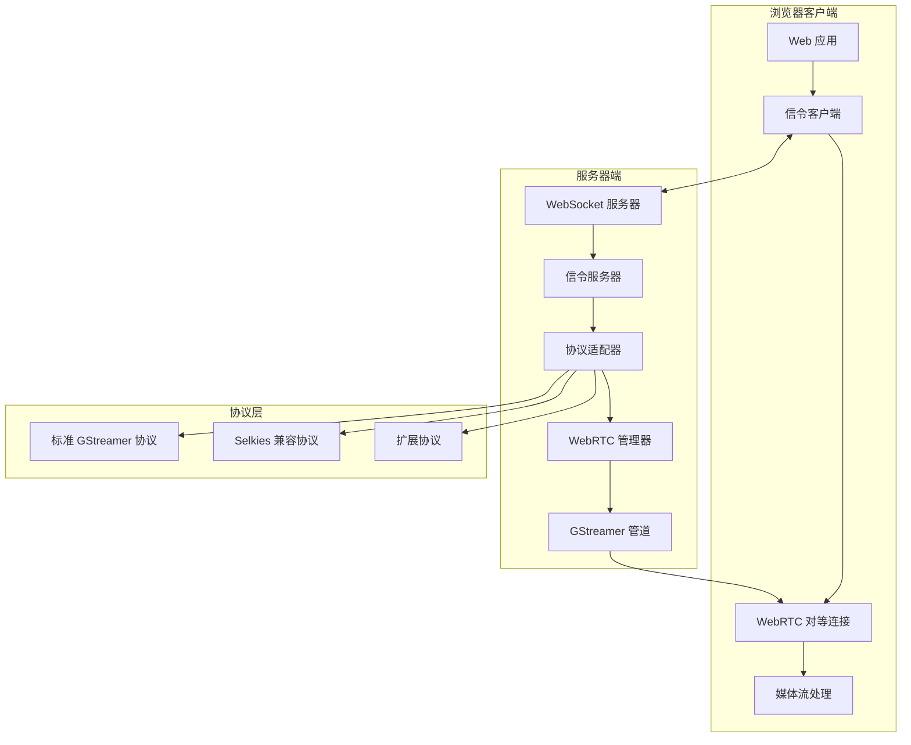
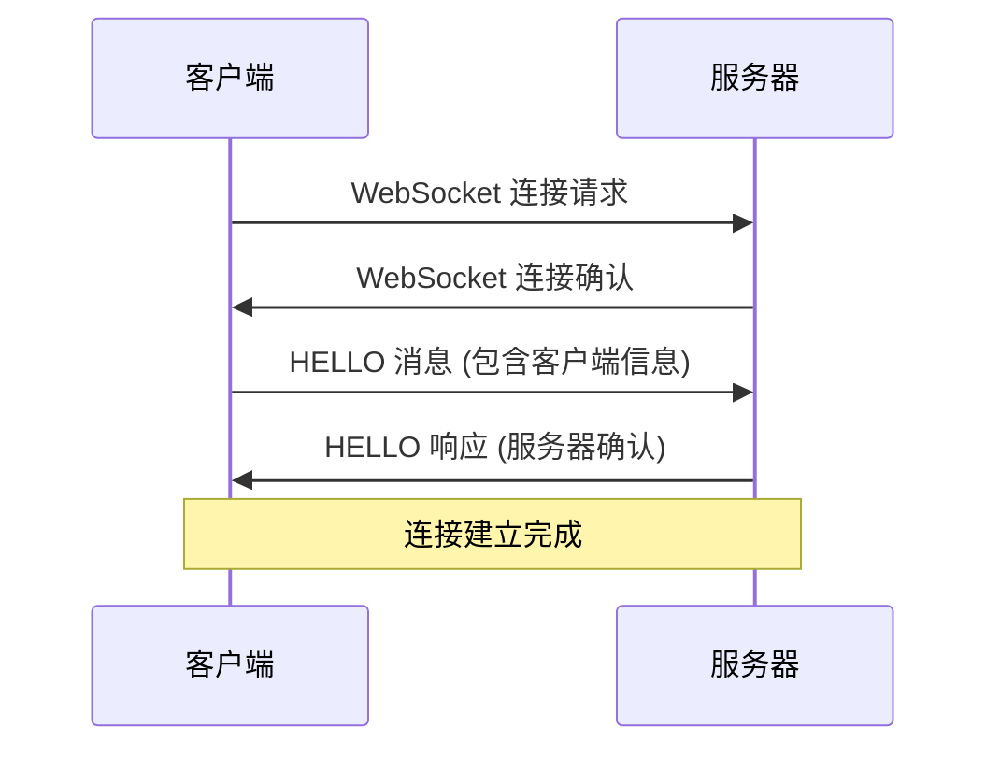
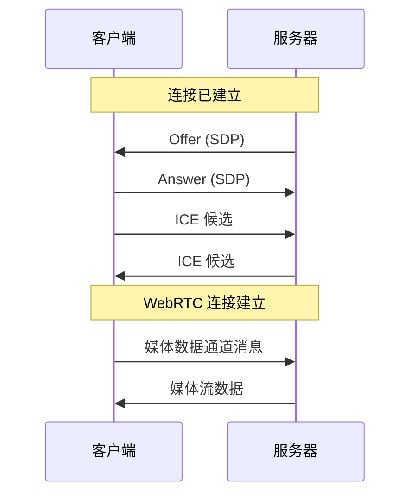
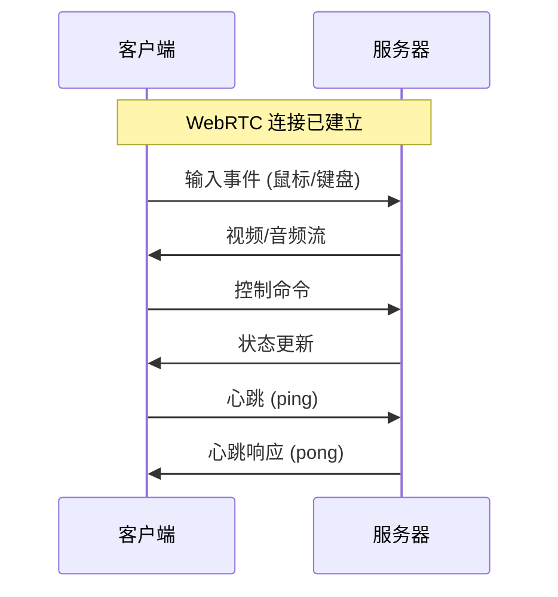

# GStreamer WebRTC 信令协议概述

## 简介

本文档描述了基于 GStreamer WebRTC 的信令协议标准，该协议用于在浏览器客户端和 GStreamer 服务端之间建立 WebRTC 连接。协议设计遵循 GStreamer 官方信令协议规范，同时保持与 selkies-gstreamer 项目的向后兼容性。

## 协议版本

- **当前版本**: 1.0
- **兼容版本**: selkies-gstreamer 协议
- **基于标准**: [GStreamer WebRTC 信令协议](https://github.com/GStreamer/gstreamer/blob/main/subprojects/gst-examples/webrtc/signaling/Protocol.md)

## 整体架构



## 通信流程

### 1. 连接建立阶段



### 2. WebRTC 协商阶段



### 3. 数据传输阶段



## 协议特性

### 核心特性

1. **双向通信**: 支持客户端和服务器之间的双向消息传递
2. **实时性**: 低延迟的媒体流传输和控制响应
3. **可靠性**: 包含连接状态管理和错误恢复机制
4. **扩展性**: 支持自定义消息类型和协议扩展

### 兼容性特性

1. **向后兼容**: 支持 selkies-gstreamer 协议格式
2. **协议协商**: 自动检测和适配不同协议版本
3. **渐进升级**: 支持从旧协议平滑迁移到新协议

### 安全特性

1. **消息验证**: 严格的消息格式和内容验证
2. **连接管理**: 超时检测和异常连接清理
3. **错误处理**: 详细的错误分类和恢复机制

## 消息类型概览

### 连接管理消息

| 消息类型 | 方向 | 描述 |
|---------|------|------|
| `hello` | C→S | 客户端注册和能力协商 |
| `welcome` | S→C | 服务器欢迎和确认消息 |
| `ping` | C↔S | 连接保活心跳 |
| `pong` | C↔S | 心跳响应 |
| `error` | S→C | 错误通知 |

### WebRTC 协商消息

| 消息类型 | 方向 | 描述 |
|---------|------|------|
| `request-offer` | C→S | 请求 WebRTC Offer |
| `offer` | S→C | WebRTC SDP Offer |
| `answer` | C→S | WebRTC SDP Answer |
| `ice-candidate` | C↔S | ICE 候选交换 |

### 媒体控制消息

| 消息类型 | 方向 | 描述 |
|---------|------|------|
| `mouse-click` | C→S | 鼠标点击事件 |
| `mouse-move` | C→S | 鼠标移动事件 |
| `key-press` | C→S | 键盘按键事件 |
| `get-stats` | C→S | 请求统计信息 |
| `stats` | S→C | 统计信息响应 |

### Selkies 兼容消息

| 消息类型 | 方向 | 描述 |
|---------|------|------|
| `sdp` | C↔S | SDP 消息 (selkies 格式) |
| `ice` | C↔S | ICE 候选 (selkies 格式) |

## 协议适配

### 标准协议适配器

负责处理符合 GStreamer 官方规范的消息格式：

```javascript
// 标准消息格式
{
  "version": "1.0",
  "type": "offer",
  "id": "msg_12345",
  "timestamp": 1640995200000,
  "peer_id": "client_001",
  "data": {
    "sdp": {
      "type": "offer",
      "sdp": "v=0\r\no=- ..."
    }
  }
}
```

### Selkies 兼容适配器

负责处理 selkies-gstreamer 格式的消息：

```javascript
// Selkies 消息格式
{
  "sdp": {
    "type": "offer", 
    "sdp": "v=0\r\no=- ..."
  }
}

// 或简单文本格式
"HELLO 1 eyJyZXMiOiIxOTIweDEwODAiLCJzY2FsZSI6MX0="
```

## 错误处理

### 错误分类

1. **连接错误**: 网络连接、WebSocket 相关错误
2. **协议错误**: 消息格式、协议版本不匹配
3. **WebRTC 错误**: SDP 处理、ICE 收集失败
4. **服务器错误**: 内部错误、资源不足

### 错误恢复策略

1. **自动重连**: 网络中断时的指数退避重连
2. **协议降级**: 不兼容时自动切换到兼容协议
3. **状态重置**: 错误状态下的连接和状态重置
4. **用户通知**: 关键错误的用户界面反馈

## 性能考虑

### 消息优化

1. **消息大小限制**: 单个消息最大 64KB
2. **批量处理**: ICE 候选的批量发送
3. **压缩**: 大型 SDP 消息的可选压缩

### 连接优化

1. **连接池**: 复用 WebSocket 连接
2. **心跳优化**: 智能心跳频率调整
3. **缓冲管理**: 发送缓冲区大小优化

## 扩展机制

### 自定义消息类型

协议支持添加自定义消息类型，需要遵循以下规范：

1. 消息类型名称使用小写字母和连字符
2. 包含完整的数据验证规则
3. 提供向后兼容性处理

### 协议版本管理

1. **版本协商**: 连接时的版本能力交换
2. **多版本支持**: 同时支持多个协议版本
3. **平滑升级**: 渐进式协议版本升级

## 实施指南

### 客户端实施要点

1. 实现标准 WebSocket 连接管理
2. 支持多种消息格式的解析和生成
3. 实现健壮的错误处理和重连机制
4. 提供清晰的状态管理接口

### 服务端实施要点

1. 实现高性能的 WebSocket 服务器
2. 支持协议适配和自动检测
3. 实现完整的消息验证机制
4. 提供详细的日志和监控

## 测试和验证

### 协议兼容性测试

1. 标准协议消息格式验证
2. Selkies 协议向后兼容测试
3. 协议版本协商测试
4. 错误处理和恢复测试

### 性能测试

1. 大量并发连接测试
2. 消息处理性能测试
3. 内存使用和泄漏测试
4. 网络适应性测试

## 参考资料

1. [GStreamer WebRTC 官方文档](https://gstreamer.freedesktop.org/documentation/webrtc/index.html)
2. [GStreamer 信令协议规范](https://github.com/GStreamer/gstreamer/blob/main/subprojects/gst-examples/webrtc/signaling/Protocol.md)
3. [selkies-gstreamer 项目](https://github.com/GoogleCloudPlatform/selkies-gstreamer)
4. [WebRTC 标准规范](https://www.w3.org/TR/webrtc/)
5. [WebSocket 协议规范](https://tools.ietf.org/html/rfc6455)