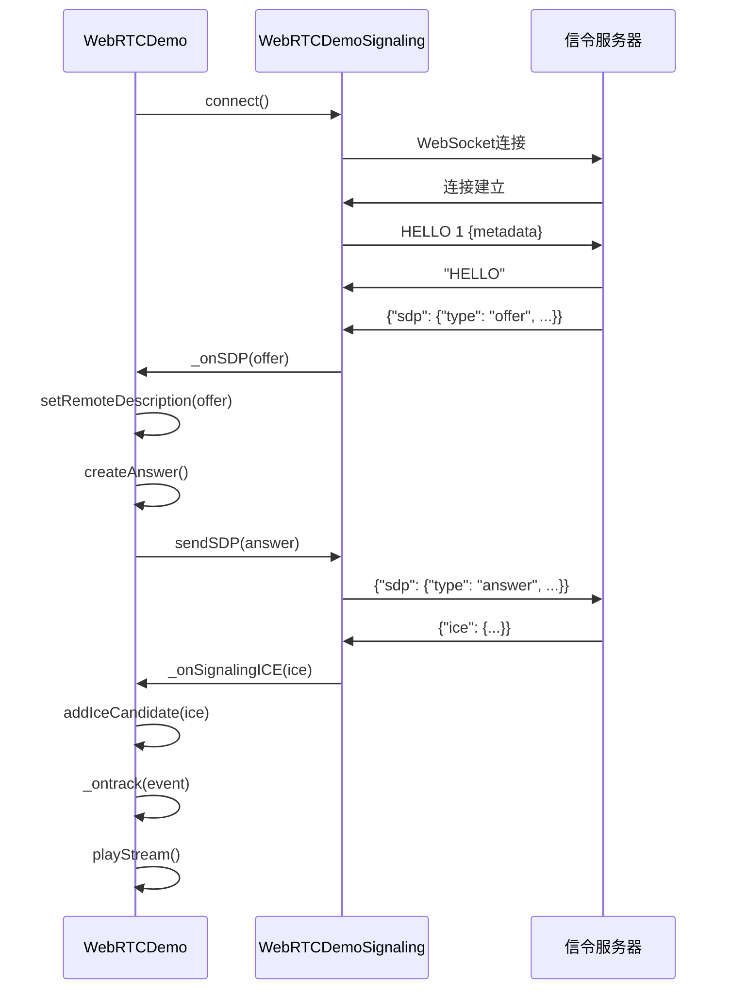
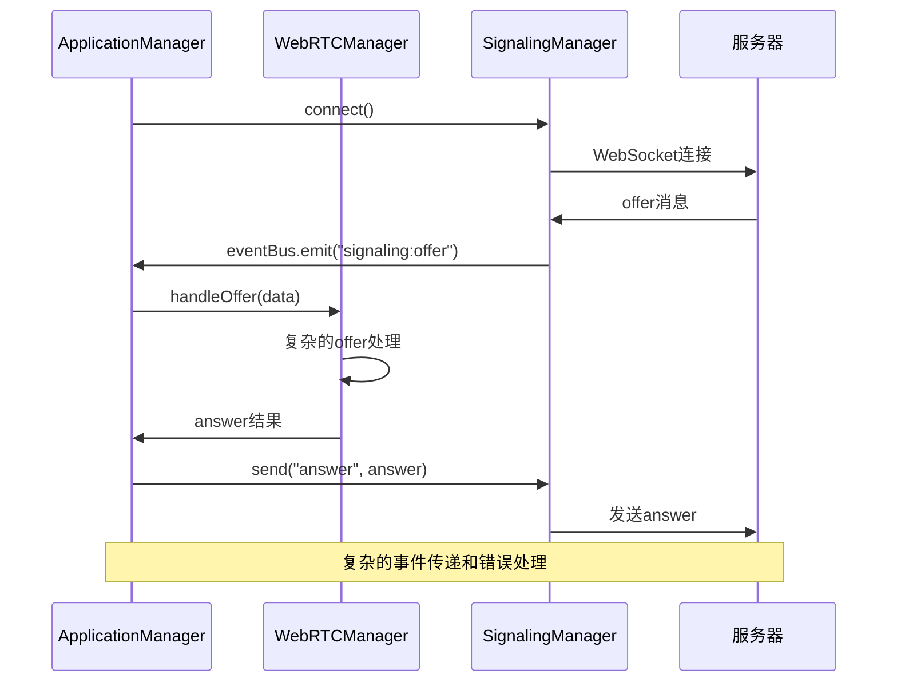

# Selkies-GStreamer 核心实现分析报告

## 概述

本报告详细分析了 selkies-gstreamer 项目的 WebRTC 核心实现，包括 WebRTCDemo 类、WebRTCDemoSignaling 类的实现逻辑，以及与 internal/webserver/static 项目的关键差异。

## 1. WebRTCDemo 类分析

### 1.1 核心架构设计

**selkies-gstreamer 的 WebRTCDemo 类特点：**

```javascript
class WebRTCDemo {
    constructor(signaling, element, peer_id) {
        this.signaling = signaling;
        this.element = element;
        this.peer_id = peer_id;
        this.peerConnection = null;
        this.rtcPeerConfig = {
            "lifetimeDuration": "86400s",
            "iceServers": [{"urls": ["stun:stun.l.google.com:19302"]}],
            "blockStatus": "NOT_BLOCKED",
            "iceTransportPolicy": "all"
        };
        this._send_channel = null;
        this.input = new Input(this.element, (data) => {
            if (this._connected && this._send_channel !== null && this._send_channel.readyState === 'open') {
                this._send_channel.send(data);
            }
        });
    }
}
```

**关键设计原则：**
1. **简单直接的架构** - 没有复杂的模块化设计
2. **直接的 RTCPeerConnection 管理** - 不通过多层抽象
3. **内置输入处理** - 直接集成 Input 类
4. **简化的错误处理** - 基本的错误处理和重连机制

### 1.2 连接建立流程

**selkies 的连接建立逻辑：**

```javascript
connect() {
    // 创建 PeerConnection
    this.peerConnection = new RTCPeerConnection(this.rtcPeerConfig);
    
    // 绑定事件处理器
    this.peerConnection.ontrack = this._ontrack.bind(this);
    this.peerConnection.onicecandidate = this._onPeerICE.bind(this);
    this.peerConnection.ondatachannel = this._onPeerdDataChannel.bind(this);
    this.peerConnection.onconnectionstatechange = () => {
        this._handleConnectionStateChange(this.peerConnection.connectionState);
        this._setConnectionState(this.peerConnection.connectionState);
    };
    
    // 连接信令服务器
    this.signaling.peer_id = this.peer_id;
    this.signaling.connect();
}
```

### 1.3 SDP 处理逻辑

**selkies 的 SDP 处理：**

```javascript
_onSDP(sdp) {
    if (sdp.type != "offer") {
        this._setError("received SDP was not type offer.");
        return;
    }
    
    this.peerConnection.setRemoteDescription(sdp).then(() => {
        this.peerConnection.createAnswer()
            .then((local_sdp) => {
                // SDP 优化处理
                if (!(/[^-]sps-pps-idr-in-keyframe=1[^\d]/gm.test(local_sdp.sdp))) {
                    local_sdp.sdp = local_sdp.sdp.replace('packetization-mode=', 'sps-pps-idr-in-keyframe=1;packetization-mode=');
                }
                
                // 音频优化
                if (!(/[^-]stereo=1[^\d]/gm.test(local_sdp.sdp))) {
                    local_sdp.sdp = local_sdp.sdp.replace('useinbandfec=', 'stereo=1;useinbandfec=');
                }
                
                this.peerConnection.setLocalDescription(local_sdp).then(() => {
                    this.signaling.sendSDP(this.peerConnection.localDescription);
                });
            });
    });
}
```

### 1.4 媒体流处理

**selkies 的媒体流处理：**

```javascript
_ontrack(event) {
    this._setStatus("Received incoming " + event.track.kind + " stream from peer");
    if (!this.streams) this.streams = [];
    this.streams.push([event.track.kind, event.streams]);
    
    if (event.track.kind === "video" || event.track.kind === "audio") {
        this.element.srcObject = event.streams[0];
        this.playStream();
    }
}

playStream() {
    this.element.load();
    var playPromise = this.element.play();
    if (playPromise !== undefined) {
        playPromise.then(() => {
            this._setDebug("Stream is playing.");
        }).catch(() => {
            if (this.onplaystreamrequired !== null) {
                this.onplaystreamrequired();
            }
        });
    }
}
```

### 1.5 数据通道处理

**selkies 的数据通道实现：**

```javascript
_onPeerdDataChannel(event) {
    this._setStatus("Peer data channel created: " + event.channel.label);
    this._send_channel = event.channel;
    this._send_channel.onmessage = this._onPeerDataChannelMessage.bind(this);
    this._send_channel.onopen = () => {
        if (this.ondatachannelopen !== null) this.ondatachannelopen();
    };
    this._send_channel.onclose = () => {
        if (this.ondatachannelclose !== null) this.ondatachannelclose();
    };
}

sendDataChannelMessage(message) {
    if (this._send_channel !== null && this._send_channel.readyState === 'open') {
        this._send_channel.send(message);
    } else {
        this._setError("attempt to send data channel message before channel was open.");
    }
}
```

## 2. WebRTCDemoSignaling 类分析

### 2.1 信令协议设计

**selkies 的信令协议：**

```javascript
class WebRTCDemoSignaling {
    constructor(server) {
        this._server = server;
        this.peer_id = 1;
        this._ws_conn = null;
        this.state = 'disconnected';
        this.retry_count = 0;
    }
}
```

**协议消息格式：**

1. **HELLO 消息：**
   ```javascript
   // 发送注册消息
   this._ws_conn.send(`HELLO ${this.peer_id} ${btoa(JSON.stringify(meta))}`);
   
   // 服务器响应
   if (event.data === "HELLO") {
       this._setStatus("Registered with server.");
   }
   ```

2. **SDP 消息：**
   ```javascript
   // 发送 SDP
   sendSDP(sdp) {
       this._ws_conn.send(JSON.stringify({ 'sdp': sdp }));
   }
   
   // 接收 SDP
   if (msg.sdp != null) {
       this._setSDP(new RTCSessionDescription(msg.sdp));
   }
   ```

3. **ICE 候选消息：**
   ```javascript
   // 发送 ICE 候选
   sendICE(ice) {
       this._ws_conn.send(JSON.stringify({ 'ice': ice }));
   }
   
   // 接收 ICE 候选
   if (msg.ice != null) {
       var icecandidate = new RTCIceCandidate(msg.ice);
       this._setICE(icecandidate);
   }
   ```

### 2.2 连接管理

**selkies 的连接管理逻辑：**

```javascript
connect() {
    this.state = 'connecting';
    this._setStatus("Connecting to server.");
    this._ws_conn = new WebSocket(this._server);
    
    this._ws_conn.addEventListener('open', this._onServerOpen.bind(this));
    this._ws_conn.addEventListener('error', this._onServerError.bind(this));
    this._ws_conn.addEventListener('message', this._onServerMessage.bind(this));
    this._ws_conn.addEventListener('close', this._onServerClose.bind(this));
}

_onServerOpen() {
    var currRes = webrtc.input.getWindowResolution();
    var meta = {
        "res": parseInt(currRes[0]) + "x" + parseInt(currRes[1]),
        "scale": window.devicePixelRatio
    };
    this.state = 'connected';
    this._ws_conn.send(`HELLO ${this.peer_id} ${btoa(JSON.stringify(meta))}`);
    this.retry_count = 0;
}
```

### 2.3 重连机制

**selkies 的重连策略：**

```javascript
_onServerError() {
    this._setStatus("Connection error, retry in 3 seconds.");
    this.retry_count++;
    if (this._ws_conn.readyState === this._ws_conn.CLOSED) {
        setTimeout(() => {
            if (this.retry_count > 3) {
                window.location.reload();  // 简单粗暴的重载页面
            } else {
                this.connect();
            }
        }, 3000);
    }
}
```

## 3. 与 internal 项目的关键差异

### 3.1 架构复杂度对比

**selkies-gstreamer (简单)：**
```
app.js (Vue应用)
├── WebRTCDemo类 (直接管理RTCPeerConnection)
└── WebRTCDemoSignaling类 (原生WebSocket)
```

**internal 项目 (复杂)：**
```
app.js (ApplicationManager)
├── WebRTCManager类 (复杂的模块化设计)
├── SignalingManager类 (复杂的消息路由)
├── UIManager类
├── InputManager类
└── MonitoringManager类
```

### 3.2 API 接口差异

**selkies 的简单接口：**
```javascript
// 直接的方法调用
webrtc.connect();
webrtc.sendDataChannelMessage(message);
webrtc.playStream();

// 简单的事件回调
webrtc.onstatus = (message) => { /* 处理状态 */ };
webrtc.onerror = (message) => { /* 处理错误 */ };
```

**internal 的复杂接口：**
```javascript
// 通过事件总线通信
this.eventBus.emit("signaling:offer", data);
this.eventBus.on("webrtc:connection-state-change", handler);

// 复杂的模块间依赖
await this.modules.webrtc.handleOffer(data);
await this.modules.signaling.send("answer", answer);
```

### 3.3 错误处理差异

**selkies 的简单错误处理：**
```javascript
_setError(message) {
    if (this.onerror !== null) {
        this.onerror(message);
    }
}

// 简单的重连逻辑
if (this.retry_count > 3) {
    window.location.reload();
} else {
    this.connect();
}
```

**internal 的复杂错误处理：**
```javascript
// 复杂的错误分类和处理
this.ERROR_TYPES = {
    CONNECTION: "connection",
    MEDIA: "media", 
    NETWORK: "network",
    CONFIG: "config",
    SIGNALING: "signaling",
    TIMEOUT: "timeout"
};

// 复杂的恢复策略
const RecoveryStrategies = {
    ICE_CONNECTION_FAILED: () => { webrtc.reset(); },
    MEDIA_TRACK_ENDED: () => { signaling.connect(); }
};
```

### 3.4 消息协议差异

**selkies 协议 (标准且简单)：**
```javascript
// 注册消息
"HELLO 1 eyJyZXMiOiIxOTIweDEwODAiLCJzY2FsZSI6MX0="

// SDP 消息
{"sdp": {"type": "offer", "sdp": "v=0\r\no=..."}}

// ICE 消息
{"ice": {"candidate": "candidate:...", "sdpMid": "0", "sdpMLineIndex": 0}}

// 错误消息
"ERROR Invalid peer ID"
```

**internal 协议 (复杂且自定义)：**
```javascript
// 复杂的消息结构
{
    "id": 123,
    "type": "offer",
    "data": {...},
    "timestamp": 1640995200000
}

// 复杂的响应处理
{
    "id": 123,
    "type": "response", 
    "data": {...},
    "error": null
}
```

## 4. 连接建立和媒体流处理流程

### 4.1 selkies 的连接流程



### 4.2 internal 的连接流程



## 5. 关键问题识别

### 5.1 架构复杂性问题

**internal 项目的问题：**
1. **过度工程化** - 不必要的模块化和抽象层
2. **事件传递链过长** - 增加了出错的可能性
3. **状态管理复杂** - 多个模块的状态同步困难
4. **调试困难** - 复杂的调用链难以追踪问题

### 5.2 协议兼容性问题

**协议差异导致的问题：**
1. **消息格式不匹配** - selkies 使用简单的文本和JSON格式
2. **握手流程不同** - HELLO消息的处理方式不同
3. **错误处理不一致** - ERROR消息的格式和处理不同

### 5.3 性能问题

**internal 项目的性能问题：**
1. **连接建立慢** - 复杂的初始化流程
2. **内存使用高** - 多个管理器实例和事件监听器
3. **CPU占用高** - 频繁的事件传递和状态检查

## 6. 修复建议

### 6.1 架构简化

**建议采用 selkies 的简化架构：**
1. **移除不必要的管理器** - 只保留核心的 WebRTC 和 Signaling 功能
2. **直接的方法调用** - 避免复杂的事件总线
3. **简化的状态管理** - 减少状态同步的复杂性

### 6.2 协议对齐

**统一使用 selkies 协议：**
1. **HELLO 消息格式** - `HELLO ${peer_id} ${btoa(JSON.stringify(meta))}`
2. **SDP 消息格式** - `{"sdp": {"type": "offer/answer", "sdp": "..."}}`
3. **ICE 消息格式** - `{"ice": {"candidate": "...", "sdpMid": "...", "sdpMLineIndex": 0}}`
4. **错误消息格式** - `"ERROR message"`

### 6.3 实现策略

**分阶段实现：**
1. **第一阶段** - 重构 WebRTCManager 类，基于 selkies 的 WebRTCDemo 实现
2. **第二阶段** - 重构 SignalingManager 类，基于 selkies 的 WebRTCDemoSignaling 实现
3. **第三阶段** - 简化 ApplicationManager，移除不必要的复杂性
4. **第四阶段** - 更新服务端以支持 selkies 协议

## 7. 结论

通过详细分析，发现 selkies-gstreamer 项目采用了更简单、更直接的架构设计，这正是其能够稳定工作的关键原因。internal 项目的过度复杂化是导致视频流捕获失败的根本原因。

**核心差异总结：**
1. **架构设计** - selkies 简单直接 vs internal 复杂模块化
2. **协议实现** - selkies 标准协议 vs internal 自定义协议  
3. **错误处理** - selkies 简单重试 vs internal 复杂恢复策略
4. **性能优化** - selkies 轻量级 vs internal 重量级

**修复方向：**
以 selkies-gstreamer 项目为标准，简化 internal 项目的实现，采用经过验证的简单架构和标准协议，确保 WebRTC 视频流捕获功能的稳定性和可靠性。